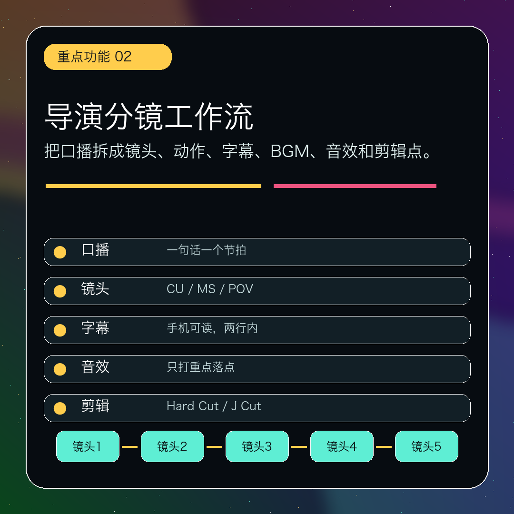
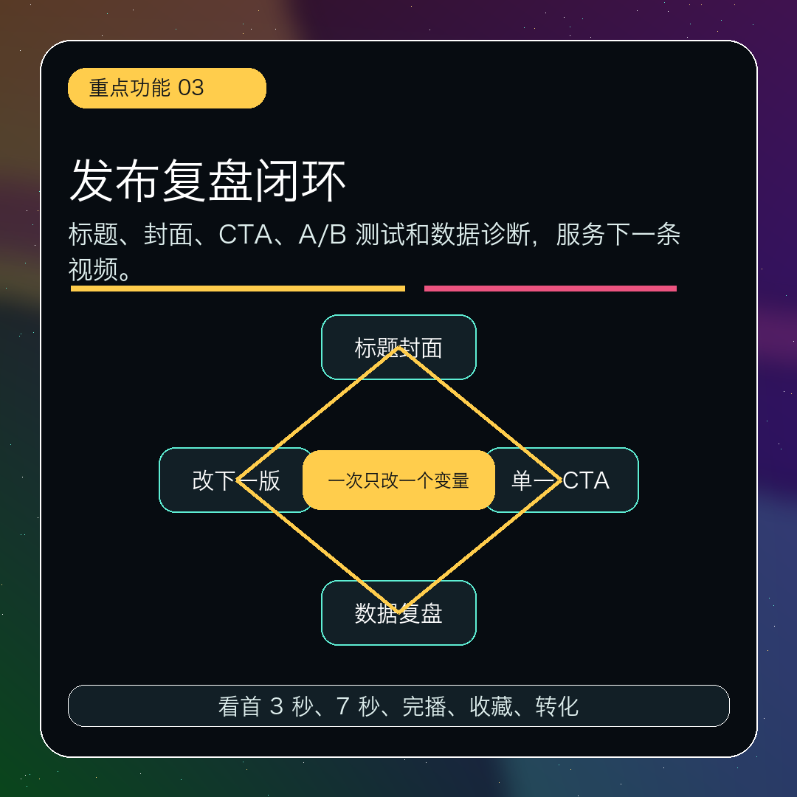

# viral-hook-script-skill

爆款 3 秒钩子与节奏化短视频脚本生成器，一个面向老师、知识博主、课程创作者和产品讲解场景的 Codex Skill。

它把一个主题、原稿、产品说明或课程内容，转成可直接拍摄、录音、剪辑和发布的短视频导演工作流。

## 适合谁

- 老师
- AI 教育创作者
- 短视频口播博主
- 课程研发人员
- 摄影和微景观内容创作者
- 需要批量优化视频脚本的人

## 核心功能

- 内容定位分析
- 目标用户画像
- 核心卖点提炼
- 20 个 3 秒钩子
- 钩子评分与 Top 5 推荐
- 15 秒、30 秒、60 秒口播脚本
- 镜头级导演分镜
- 口播节奏、停顿、重读、字幕设计
- BGM、音效和剪辑节奏
- 关键点图示：流程图、对比图、检查清单、诊断树
- 标题、封面文案、简介、标签和 CTA
- A/B 测试方案
- 发布后数据复盘建议

## 适配场景

- 视频号
- 抖音
- 小红书
- B站
- TikTok
- Reels
- Kimi
- ChatGPT
- DeepSeek
- WorkBuddy

## 最小使用示例

```text
使用 $viral-hook-script-skill
主题：老师如何用 AI 提高备课效率
平台：视频号
时长：30 秒
目标用户：中小学教师
目标：提高收藏和关注
模式：完整导演版
```

## 项目结构

```text
viral-hook-script-skill/
├── SKILL.md
├── README.md
├── CHANGELOG.md
├── prompts/
├── templates/
├── examples/
├── evals/
└── docs/
```

## Skill 入口

核心 Skill 文件：

```text
viral-hook-script-skill/SKILL.md
```

详细使用说明：

```text
viral-hook-script-skill/README.md
```

## 海报

项目海报位于：

```text
viral-hook-script-skill/assets/teacher-short-video-director-workflow-poster-clean.png
```


## 重点图片

### 1. 3 秒钩子引擎


### 2. 导演分镜工作流



### 3. 发布复盘闭环



## License

MIT
