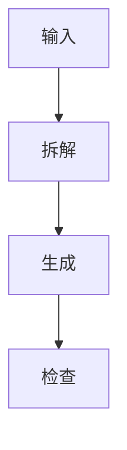
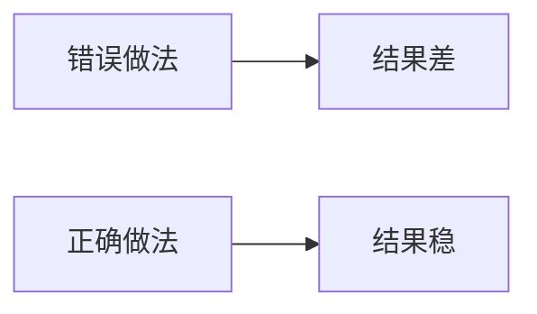
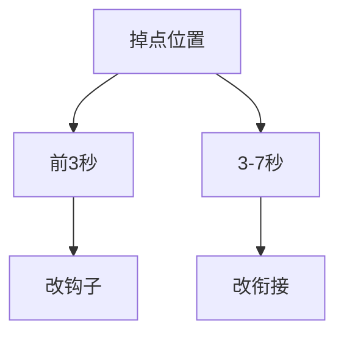

# 关键点图示指南

## 什么时候必须加图示

- 用户讲流程：用流程图。
- 用户讲避坑：用错误清单或检查清单。
- 用户讲前后差异：用对比图。
- 用户讲产品能力：用工作流图。
- 用户讲方法论：用三段式或四象限框架。
- 用户讲数据复盘：用漏斗或诊断树。

## 设计原则

- 一条视频只放一个主图示。
- 3-5 个节点最稳。
- 每个节点 2-8 个汉字。
- 图示用于降低理解成本，不用于装饰。
- 9:16 画面优先纵向结构。
- 文字字号要大，留出安全边距。
- 避免复杂线条、长句、密集表格。

## 常用结构

### 流程图

适合教程、工具演示、课程方法。



### 对比图

适合错误纠正和前后变化。



### 检查清单

适合避坑和操作前确认。

```text
[ ] 目标清楚
[ ] 素材齐全
[ ] CTA 单一
```

### 诊断树

适合发布后复盘。



