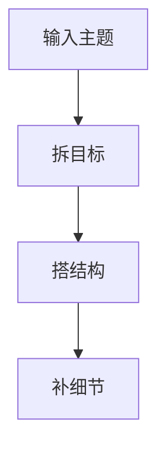

# 关键点图示模板

## 适用场景

- 流程步骤
- 前后对比
- 错误清单
- 产品工作流
- 课程方法框架
- 数据复盘路径

## 输出格式

| 项目 | 内容 |
|---|---|
| 图示类型 | 流程图 / 对比图 / 三段式框架 / 检查清单 / 漏斗图 |
| 出现时间 | 例如 10-18s |
| 画面结构 | 3-5 个节点，纵向 9:16 优先 |
| 节点文案 | 每个节点 2-8 个汉字 |
| 动效 | 逐个出现 / 高亮切换 / 勾选 / 连线推进 |
| 配色 | 高对比，避免同色系堆叠 |
| 拍摄配合 | 真人指向、屏幕录制、B-roll 叠加 |

## Mermaid 草图

## 检查

- 字幕和图示不抢同一位置。
- 单屏最多 5 个节点。
- 节点文字适合手机观看。
- 图示只解释一个核心关系。

