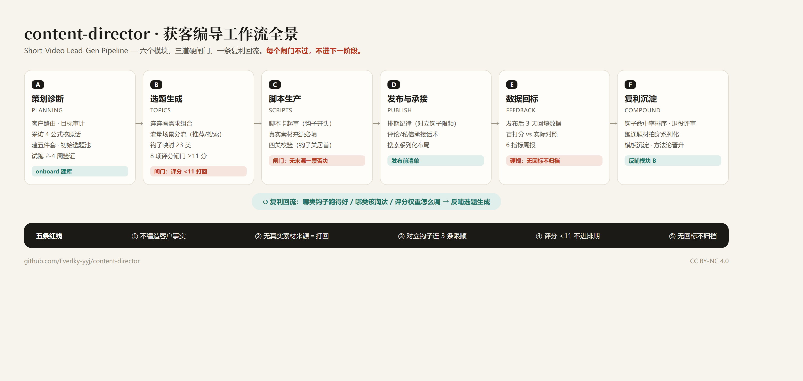
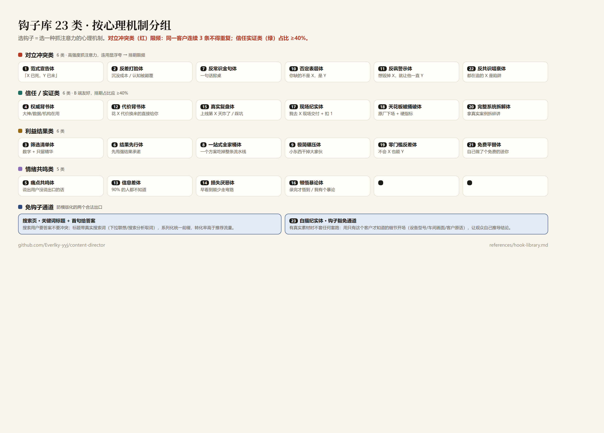

<h1 align="center">content-director · 获客编导 Agent</h1>

<p align="center">
  <strong>把你的 AI Agent 变成获客编导——每客户一个常驻循环，靠系统，不靠灵感。</strong>
</p>

<p align="center">
  简体中文
  &nbsp;·&nbsp;
  <a href="#english"><strong>English</strong></a>
</p>

<p align="center">
<a href="CHANGELOG.md"></a>
&nbsp;
<a href="LICENSE"></a>
&nbsp;

&nbsp;

</p>

<p align="center">
大部分获客账号的死法，不是没内容，是没人记账。<br>
发出去的视频没有回标，扑了不知道哪错了，爆了不知道哪对了——下一条还是掷骰子。<br>
这个 Skill 让每次发布都记账、对账，并把标准改得更准。
</p>

---

## 🎬 它到底干什么

大部分用 AI 做内容的团队，都困在同一个赌局里：

> 发视频 → 数据来了 → 啥也没学到 → 再掷一次骰子

content-director 把每一次判断都记下来、对账、喂回给下一轮：

**📊 选题评分 → 📝 脚本四关 → 🚀 发布 → 📈 3天回标 → 🧬 Aha判级 → 🔁 拍穿放大 → 标准越用越准**

这不是鸡汤，是复利——每一条不复盘的视频，都在悄悄磨损你的判断力。

---

## 🧭 和别的"AI 写作工具"有什么不同

| 别的工具 | 这个 |
| --- | --- |
| AI 替你写稿 | AI 当编导：定标准、卡闸门、记数据——**稿子还是你的** |
| 给所有人同一套建议 | 每个客户一份**专属标准卡**，从对标样本里挖出来，越用越合身 |
| 追热点给灵感 | 从"爆款 vs 普通"成对对照里挖**你这个行业**的放行标准 |
| 发完即结束 | 每条必回标：爆的**拍穿**（10-20 条变体），扑的归档换方向 |
| 单轮对话，聊完就散 | **常驻状态机**：客户没回就挂起写代办，回了接着跑，换会话不断线 |

一句话：别的工具帮你"多写"，这个帮你"判得更准"。

---

## 🤔 不能直接问 ChatGPT / DeepSeek 吗？

通用大模型给所有人同一套答案。你问"这条会不会爆"，它给你的是全球平均观点的拟合——**它不记得你，也不会因为你改变。**

这是**你客户的专属编导**：

- 评分标准是从**这个客户行业**的对标样本里挖出来的，不是训练集平均值
- 每条视频回标都会修一次标准——三个月后和第一天不是一个水平（**自动进化**）
- 它记得这个客户的对标账号、发布节奏、上三次扑街的原因——通用大模型第一轮回复之后就忘了

通用模型帮助所有人，这个只服务**你的客户**。

---

## 🔁 核心：每客户一个常驻循环

不是"跑一次出方案"的一次性工作流，而是**每客户常驻状态机**：

```text
待定位确认 → 冷启动选题 → 脚本生产 → 待拍摄发布 → 回标评估 → 拍穿放大
      ↑                        │                        │
      └──── B级改钩再测 / C级归档换方向 / 流量衰退找下一个Aha ←──┘
```

- **事件驱动唤醒**：客户确认定位 / 发素材 / 发数据 / "今天拍什么" / 定时巡检，都能唤醒
- **挂起不空转**：等客户就写代办（期限+催办方式），运行状态落盘 `05-state.md`，换会话换人都能接上
- **成功判据 = 找到 Aha Moment**：对照账号基准线（近 10 条均值）判 A/B/C 级，A 级进拍穿计划
- **巡检不断线**：`patrol` 一扫全部客户的挂起超期 / buffer 红灯 / 待复盘 / 待回标

详见 `references/persistent-loop.md`。

---

## 🎯 全流程六模块

```text
A 策划诊断 → B 选题生成 → C 脚本生产 → D 发布承接 → E 数据回标 → F 复利沉淀
```

| 模块 | 干什么 | 依据库（references/） | 引擎命令 |
| --- | --- | --- | --- |
| **A 策划诊断** | 定位五步：锁客户→商业诊断→目标审计→采访挖素材→合成定位卡（客户确认前不出题） | 定位模式库（四维/公式/人设放大法/差异化/客群拆解/起号三目标+验证清单） | `onboard` |
| **B 选题生成** | 标准挖掘（对标"爆款vs普通"成对对照→客户专属评分权重）→ 连连看矩阵 → 钩子映射 → 8项评分闸门（≥11进排期） | 标准挖掘、钩子库 23 类、评分闸门 | `seed` `matrix` `assemble` `score` |
| **C 脚本生产** | 缺口清单（有原话/空的）→ 查模式库 → 选爆款公式 → 成稿 → 三关校验+合规扫描（`check --client` 读客户标准卡校准，句长/词表按成片实测） | 文案模式库（8公式/黄金结构/金句压缩/共鸣写法）、四关校验 v2 | `check` |
| **D 发布承接** | 排期纪律机判 → 承接话术 → 盲预测（写完不可改）→ 拍/发分离（buffer 红灯先发布） | 发布承接、盲预测与 buffer | `schedule` `predict` `shoot` `publish` |
| **E 数据回标** | 3 天回标（retro 只追加）→ Aha A/B/C 机判 → 受众画像聚类 | 数据回环、隔离盲评 | `retro` `aha` `metrics` `persona` |
| **F 复利沉淀** | 标准卡 bump（全量重打+独立审核）→ 拍穿计划 → buffer 感知推荐 | bump 协议、热点候选池 | `bump` `recommend` |

跨环节：`status` 作战台（读状态机按紧急度排序）｜ `state` 断点续跑 ｜ `patrol` 巡检 ｜ `migrate`/`archive` 客户生命周期。

---

## 🛡️ 闸门与红线（内置在流程里）



- **不编造客户事实**：案例/数字填不出来源＝一票否决打回，从制度上防 AI 味
- **8 项评分闸门**：<11 分不进排期，杜绝"感觉不错"
- **钩子库 23 类**：含白描纪实体豁免通道——有真实素材时不用套路
- **排期纪律**：对立冲突钩子限频，信任实证类占比 ≥40%（`schedule` 机判）
- **无回标不归档**：每条发布后 3 天必须回填数据，否则复利机制空转
- **盲预测不可改**：预测写于看到数据之前，写完 immutable（可选 hook 物理拦截直编）
- **Refusals 清单**：明确列出"必须拒绝的请求"（如"先告诉你播放量你反推"→拒绝）



---

## 📦 安装

```bash
git clone https://github.com/Everlky-yyj/content-director.git
# 把 content-director/ 复制到你的 Agent skills 目录
cp -r content-director ~/.claude/skills/    # Claude Code
cp -r content-director ~/.codex/skills/     # Codex
# 或任何支持 SKILL.md 约定的 Agent
```

引擎只需要 Python 3.11+（纯标准库，零 pip 依赖）：

```bash
cd your-workspace
python <skills目录>/content-director/scripts/director.py onboard demo001 "示例机械" "工业设备" "评论『报价』"
python <skills目录>/content-director/scripts/director.py status
python <skills目录>/content-director/scripts/director.py state demo001   # 查看该客户运行状态
```

---

## 🚀 快速开始

1. 对你的 Agent 说：「用 content-director 给我的客户做个账号策划」
2. 按 `references/planning.md` 完成采访与定位五步，合成定位卡发客户确认（**不采访不出题**）
3. 填 `clients/<id>/matrix.json` 词表 → `matrix` 出选题池 → `score` 过闸门（首轮通用 8 项表）
4. 选题卡定钩子 → **缺口清单** → 脚本卡成稿 → `check` 三关校验+合规扫描（有标准卡加 `--client` 读客户化校准）→ `predict` 写盲预测（写完不可改）
5. 拍摄 `shoot`（buffer+1）→ 发布 `publish`（buffer-1）→ 交付含承接话术+排期
6. 3 天后 `retro` 追加复盘 → `aha` 机判 A/B/C 级（A 级进拍穿）→ 每周 `metrics` → 每月 `bump` 回修标准卡
7. 全程 `state` 看状态、`patrol` 每日巡检、`recommend` 拿下一批（buffer 感知）

完整演示见 `examples/demo-client/walkthrough.md`（虚构客户）。

---

## 🌍 环境要求

| 层 | 要求 | 说明 |
| --- | --- | --- |
| Agent 层 | 任何支持 SKILL.md 约定的 Agent | Claude Code / Codex / Pi 等 |
| 引擎层 | Python 3.11+（纯标准库，零 pip 依赖） | 实测 3.11/3.12/3.14；Windows/macOS/Linux |
| 控制台 | UTF-8 终端最佳 | 老 Windows cmd（GBK）也能跑：emoji 自动降级，不崩溃 |
| 网络 | 可选 | 引擎离线可跑；联网搜索和 `--llm` 增强才需要网络 |
| LLM | 可选 | `--llm` 用 OpenAI 兼容接口增强词表（`TOPIC_LLM_*` 环境变量），不配自动回退规则引擎 |

**不需要**：Node、数据库、Docker、任何 pip 包。数据接入走 `adapters/` 契约（对标样本/回标/热点候选的输入格式，任何取数工具可接）。

---

## 📜 License

CC BY-NC 4.0——可自由使用、修改、分享（需署名），**不得商业使用**。商业授权请联系作者。

---

*靠灵感的账号赌运气，靠系统的账号攒复利。*
*你客户下一条视频的表现，不该取决于你今天的状态。*

---

## English

<h3 align="center">content-director — Persistent Short-Video Lead-Gen Director Agent Skill</h3>

> **TL;DR**: An open-source **agent skill** (Claude Code / Codex / any SKILL.md-compatible harness) that turns any AI agent into a **short-video lead-generation director** — a **persistent per-client state machine** covering positioning → topic generation (23-hook library + 8-item scoring gate + client-specific mined weights) → scripts (machine-checked 3-gate review + compliance scan) → publishing (blind prediction + shoot/publish buffer) → data feedback (auto-baseline Aha grading) → **rubric bump & hit amplification**. Zero-dependency Python CLI (15 commands). CC BY-NC 4.0.

**The gambling loop most teams live in**: Publish → Numbers come in → Learn nothing → Roll the dice again.

This skill makes every judgment get logged, retrospected, and absorbed into the next round — so your scoring model gets sharper every cycle instead of staying a static template.

### Why not just ask a general LLM?

General assistants give everyone the same globally-averaged answer. They don't remember your client's last three flops or why they flopped. content-director keeps a **per-client standard card** mined from *that client's* benchmark hits-vs-average pairs, retuned by every retro — month three is 10× sharper than day one.

### Layout

- `SKILL.md` — entry point: director dashboard + six-module router (A–F) + persistent-loop state machine + Refusals list
- `references/` — methodology cards (Chinese): **positioning patterns**, **standard mining**, hook library (23 patterns), scoring gate, **copy patterns** (8 viral formulas / golden structure / resonance writing), script structure & 3-relation logic check, publishing & follow-up, **blind prediction & buffer cadence**, **bump protocol**, **blind-scoring isolation**, trends & candidate pool, data feedback & Aha grading, industry transfer
- `scripts/director.py` — zero-dependency CLI: `onboard / status / state / seed / matrix / assemble / score / check / predict / shoot / publish / retro / aha / patrol / schedule / recommend / bump / persona / migrate / archive / metrics`; offline by default, optional LLM enhancement via `TOPIC_LLM_*`
- `templates/` — client workspace files (console, topics, scripts, benchmarks, learning log, running state, standard card, positioning card, discovery questionnaire, gap checklist, prediction, audience)
- `adapters/` — input contracts for benchmark samples / retro data / trend candidates (bring your own data tool)
- `hooks/` — optional Claude Code PreToolUse hook physically blocking edits to immutable blind predictions
- `examples/demo-client/` — full walkthrough with a fictional client

### Install

Copy the `content-director/` folder into your agent's skills directory (`~/.claude/skills/`, `~/.codex/skills/`, or any SKILL.md-compatible harness). Requires only Python 3.11+ stdlib. Windows/macOS/Linux; degrades gracefully on legacy GBK consoles.

### Philosophy

Systems over inspiration: every topic passes a scoring gate, every script names its real material source (or gets rejected), every prediction is written blind and immutable, every published video reports back data — so the scoring model and the hook library improve with use instead of staying static templates.

### License

CC BY-NC 4.0 — free to use, modify and share with attribution; **no commercial use**. Contact the author for commercial licensing.

---

**Keywords**: agent skill, AI agent, Claude Code skill, Codex skill, short video, short-video marketing, lead generation, content marketing, 短视频获客, 内容营销, 抖音, Douyin, TikTok, 小红书, Xiaohongshu, state machine, scoring gate, blind prediction, workflow automation, Aha moment, content director
