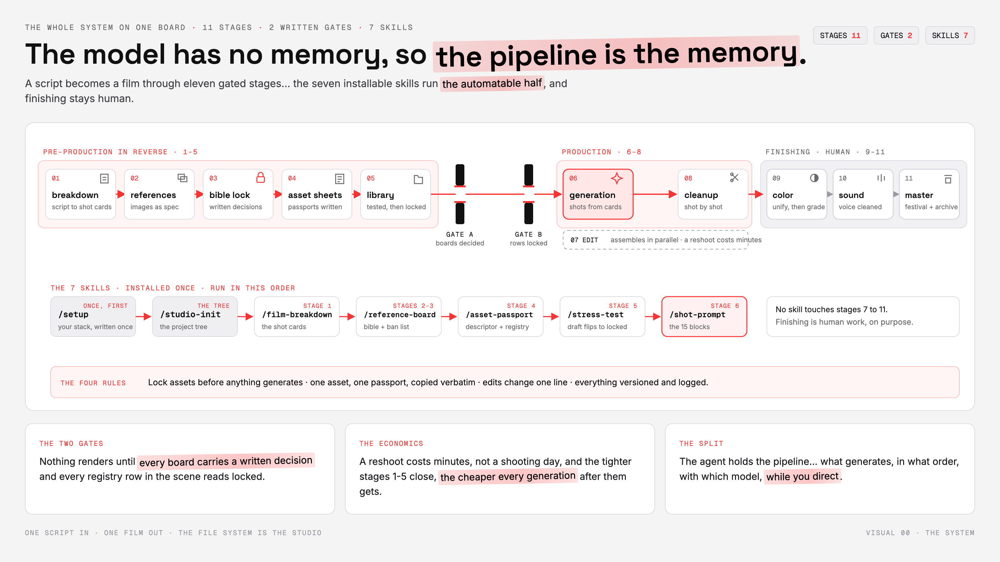
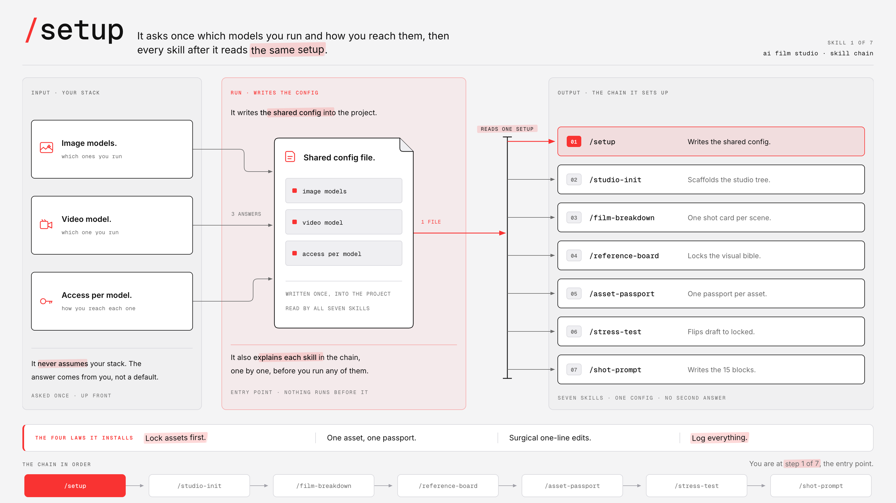
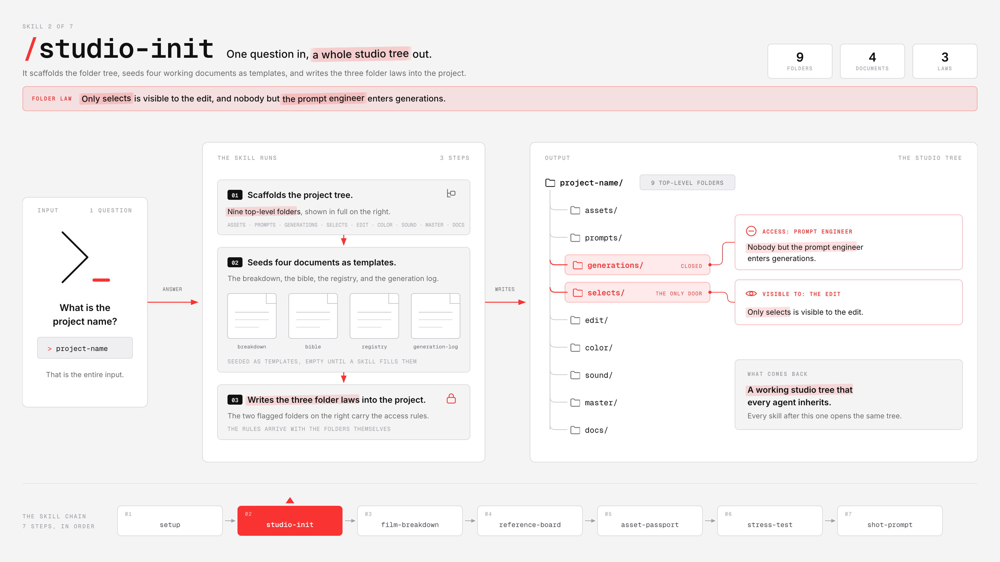
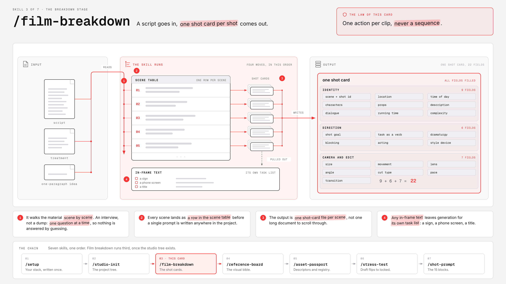
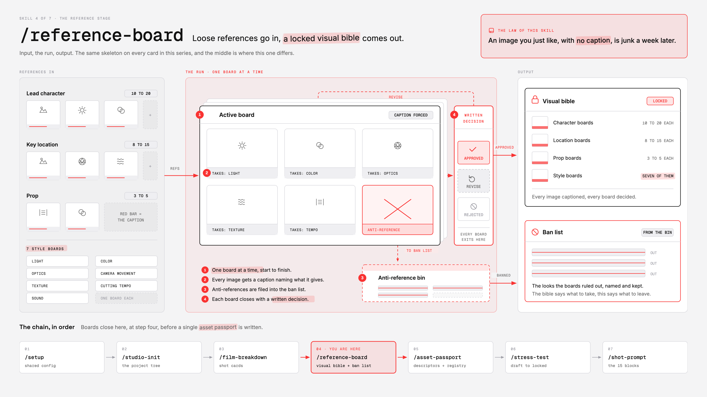
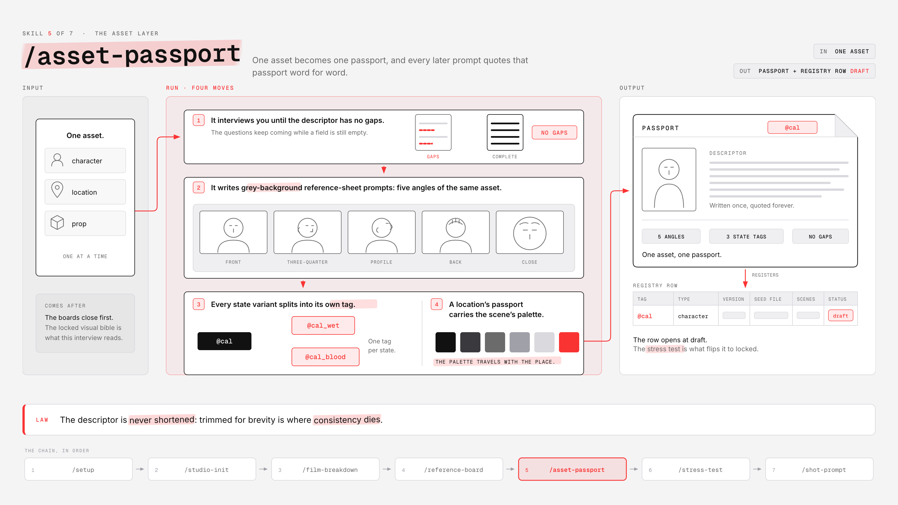
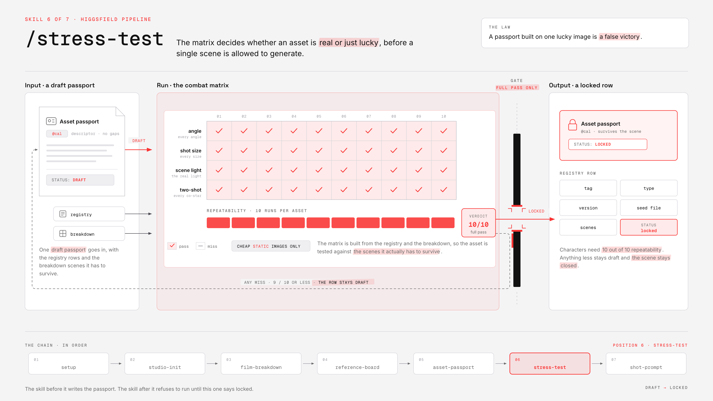
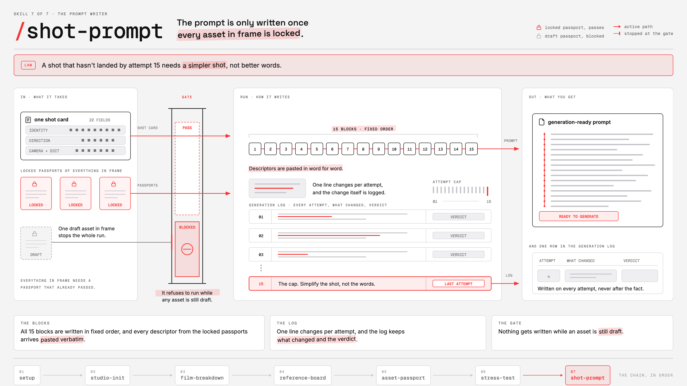

# Film Studio Skills

**The working pipeline behind multi-million dollar AI film production, condensed into 7 installable skills.**

A video model has no memory between generations. Left undescribed, a character's face, jacket and age drift between neighbouring shots — invisible on a 10-second clip, fatal across 90 minutes. Real AI film productions solve this with discipline, not luck: locked references, asset passports copied verbatim into every prompt, written gates in front of generation, and a file system that does the remembering.

These 7 skills turn that discipline into tools your agent runs. Together they take a script (or a one-paragraph idea) to generation-ready shot prompts, with every consistency gate enforced along the way.



## Install

Copy the seven folders from `skills/` into your harness's skills directory, or install from this repo:

| Harness | Install |
|---|---|
| **Claude Code** | `npx skills add <this-repo>` — or copy the folders into `~/.claude/skills/` (user) or `.claude/skills/` (project) |
| **Codex** | `npx skills add <this-repo>` and select all seven |
| **Hermes** | `hermes skills tap add <this-repo>`, or the one-paste installer with this repo's URL |
| **OpenCode** | `npx skills add <this-repo>` and select all seven |

**Verify after installing** — installers can fail silently. List your skills and confirm all seven names below appear, then run `setup`.

## The chain

The skills run in one order. Each stage's output is the next stage's input, and two of them are gates that refuse to let inconsistent work through.

```
setup → studio-init → film-breakdown → reference-board → asset-passport → stress-test → shot-prompt
```

---

## 1 · /setup — your stack, written once



The front door. It interviews you about the image models and video model you actually work with — one question at a time, never assuming or recommending a stack — and writes the shared configuration into your project's instruction files so every other skill reads the same setup. API keys never touch the config: it records only the environment variable that holds them. It ends by teaching you the chain, in order, with the four rules the whole pipeline runs on.

> Lock assets first · one asset, one passport · surgical one-line edits · log everything.

## 2 · /studio-init — the project tree



Asks one question — the project name — then scaffolds the studio: `assets/` for passports, `prompts/` for shot cards, `generations/` for raw attempts, `selects/` for accepted takes, plus the finishing chain and `docs/` with the breakdown, visual bible, registry and generation log seeded as ready templates. The file system *is* the studio, and it arrives with its three laws written in:

> Only `selects/` is visible to the edit · nobody but the prompt engineer enters `generations/` · a reference file is never renamed — a new version is a new file.

## 3 · /film-breakdown — the shot cards



Takes a script, a treatment, or a one-paragraph idea and walks it scene by scene, one question at a time — writing the scene table and one shot-card file per scene as it goes. Every shot leaves with all 22 fields filled across three lanes (identity, direction, camera + edit), and any in-frame text is pulled onto its own task list before you ever prompt, because video models write text badly and titles belong to the edit.

> One action per clip, never a sequence.

## 4 · /reference-board — the visual bible



References are a specification, not inspiration: find the existing image first, then describe it. The skill runs the interview one board at a time — you supply the references, it forces a caption on every image naming exactly what is taken from it, files every anti-reference into the ban list, and closes each board with a written decision: approved, revise, or rejected. Nothing gets called locked without that decision on the board.

> An image you just like, with no caption, is junk a week later.

## 5 · /asset-passport — one asset, one truth



Builds one asset at a time: it interviews you until the descriptor has no gaps, writes the grey-background reference-sheet prompts for your image model (front, three-quarter, profile, back, close), splits every state variant into its own tagged asset — `@cal`, `@cal_wet`, `@cal_blood` — and files the registry row at `draft`. That descriptor is later copied word for word into every prompt the asset appears in.

> The descriptor is never shortened: trimmed for brevity is where consistency dies.

## 6 · /stress-test — draft flips to locked



A passport built on one lucky image is a false victory. This skill reads your registry and breakdown, builds the combat matrix — different angles and shot sizes, the real light of the asset's actual scenes, a two-shot beside every co-star — and hands you the test prompts, all cheap static images. Characters need 10 out of 10 repeatability. On a full pass the registry row flips to `locked`; anything less stays `draft` and the scene stays closed.

> Generation for a scene starts only when every registry row it touches reads locked.

## 7 · /shot-prompt — the 15 blocks



Takes one shot card plus the locked passports of everything in frame — and refuses to write a generation-ready prompt while any of those assets is still draft. Then it writes the same 15 blocks in the same fixed order (no negative prompt: every prohibition rewritten as what IS in frame), with every descriptor pasted verbatim, and keeps the generation log with you: one line changed per attempt, every attempt logged with its verdict.

> A shot that hasn't landed by attempt 15 needs a simpler shot, not better words.

---

## The law the whole system rests on

Models will swap out from under this pipeline — treat any model table as a snapshot. The sequence and the gates are the part you keep.

**The model has no memory, so the pipeline is the memory.**

## Credit

Built by [Machina](https://x.com/EXM7777).
